# 🧩 Generación de un conflicto en git y fichero .gitignore

## Primera parte – Trabajo con ramas y resolución de conflicto

En esta práctica se trabaja con un repositorio Git local y remoto para aprender a crear ramas, provocar un conflicto, resolverlo correctamente y realizar fusiones (merge) con y sin conflicto.

---

### 1️⃣ Creación y modificación del HTML

1. Creé el archivo `index.html` con una estructura básica de HTML:

   ```html
   <!DOCTYPE html>
   <html lang="es">
   <head>
     <meta charset="UTF-8">
     <meta name="viewport" content="width=device-width, initial-scale=1.0">
     <title>Tarea 6: Generación de un conflicto en git y fichero .gitignore</title>
   </head>
   <body>

   </body>
   </html>
   ```
   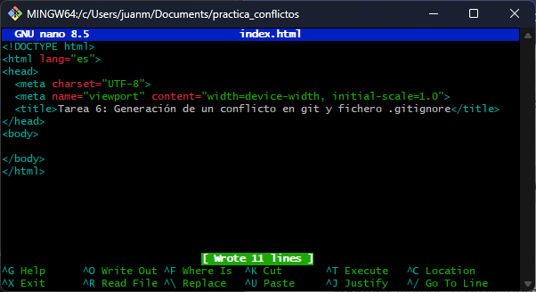

2. Añadí y confirmé los cambios:

   ```bash
   git add index.html
   git commit -m "Añadido index.html"
   ```

   

---

### 2️⃣ Creación y avance en `rama-1`

1. Creé y cambié a la nueva rama:

   ```bash
   git checkout -b rama-1
   ```

2. Añadí mi **nombre de pila** dentro del `<body>`:

   ```html
   <body>
     <p>Juan Manuel</p>
   </body>
   ```

   

3. Confirmé los cambios:

   ```bash
   git add index.html
   git commit -m "Añadido nombre al body"
   ```

   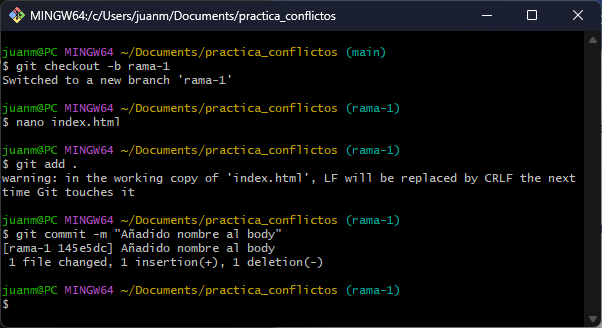

---

### 3️⃣ Creación y avance en `rama-2`

1. Volví a `main`:

   ```bash
   git checkout main
   ```

2. Creé y cambié a `rama-2`:

   ```bash
   git checkout -b rama-2
   ```

3. Añadí mis **apellidos** dentro del `<body>`:

   ```html
   <body>
     <p>Fernández Rodríguez</p>
   </body>
   ```

   

4. Confirmé los cambios:

   ```bash
   git add index.html
   git commit -m "Añadido el apellido al body"
   ```

   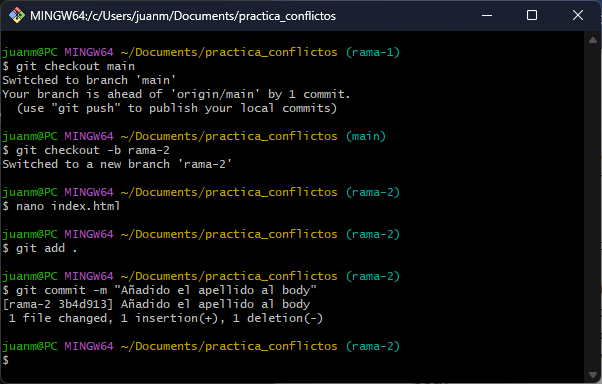

---

### 4️⃣ Visualización del estado del repositorio

Mostré el estado gráfico de las ramas y commits:

```bash
git log --oneline --graph --all
```

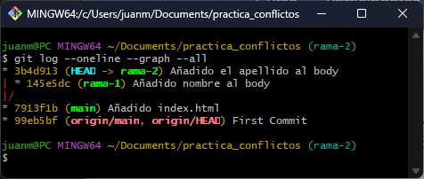

---

### 5️⃣ Generación del conflicto

Intenté fusionar las ramas:

```bash
git checkout rama-1
git merge rama-2
```


Git detectó un **conflicto** en `index.html` porque ambas ramas modificaban el mismo bloque `<body>`.

El archivo quedó así:

```html
<body>
<<<<<<< HEAD
  <p>Juan Manuel</p>
=======
  <p>Fernández Rodríguez</p>
>>>>>>> rama-2
</body>
```

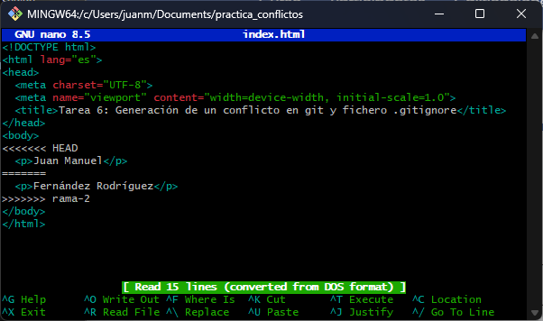

---

### 6️⃣ Resolución del conflicto

Edité el archivo para mantener ambas versiones correctamente:

```html
<body>
  <p>Juan Manuel Fernández Rodríguez</p>
</body>
```

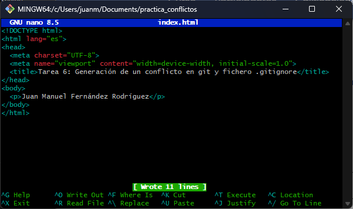

Confirmé los cambios:

```bash
git add index.html
git commit -m "Resuelto conflicto entre rama-1 y rama-2"
```

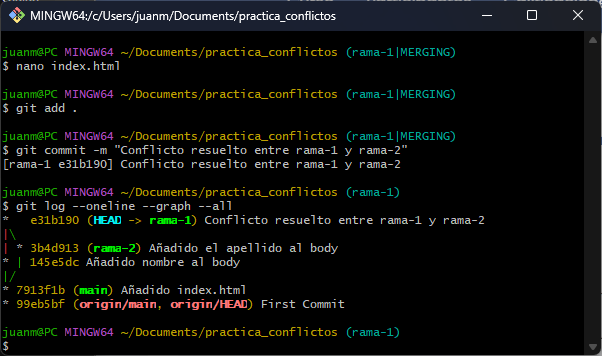

---

### 7️⃣ Fusión con `main` (fast-forward)

Volví a la rama principal:

```bash
git checkout main
git merge rama-1
```

Git realizó una **fusión fast-forward**, avanzando la rama sin crear un nuevo commit.

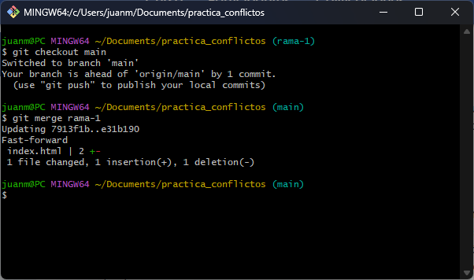

---

### 8️⃣ Commit adicional en `main`

Añadí un comentario final al archivo:

```html
<p>Finiquitado :)</p>
```

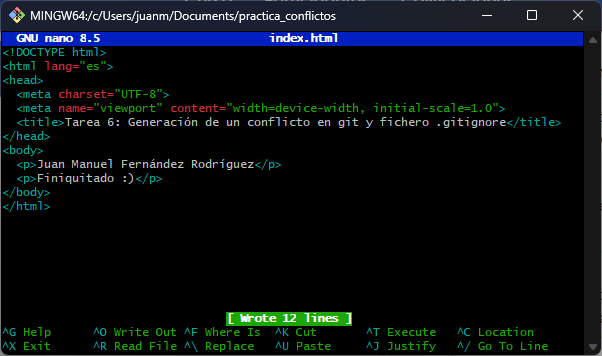

Y confirmé:

```bash
git add index.html
git commit -m "Añadido el comentario final"
```

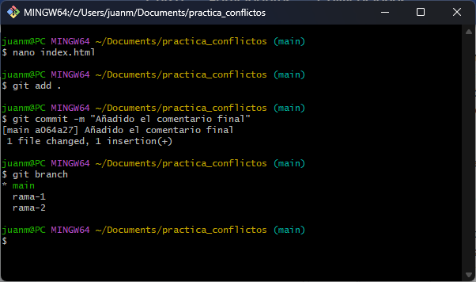

---

### 9️⃣ Eliminación de ramas fusionadas

Listé las ramas:

```bash
git branch
```

Eliminé las ramas ya fusionadas:

```bash
git branch -d rama-1
git branch -d rama-2
```

Resultado final:

```
* main
```

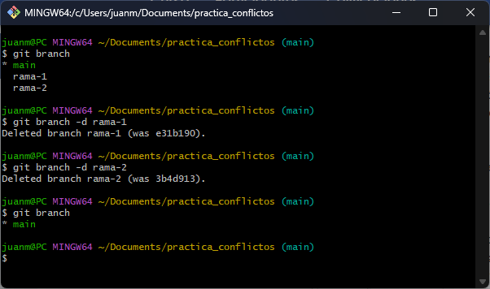

---

### 🔟 Subida de los cambios al remoto

```bash
git push origin main
```

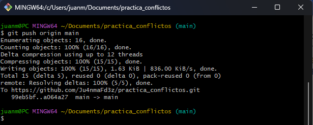

---

## Segunda parte – Archivo `.gitignore`

En el repositorio de la unidad creé un archivo `.gitignore` para excluir los archivos y carpetas indicados:

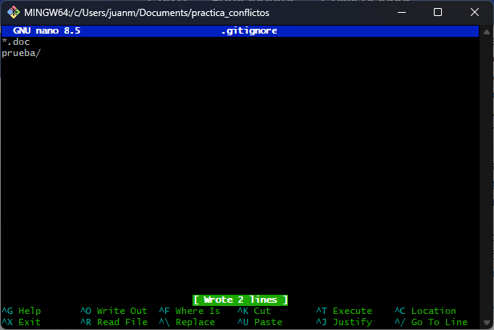

```bash
git add .gitignore
git commit -m "Añadido .gitignore"
git push origin main
```

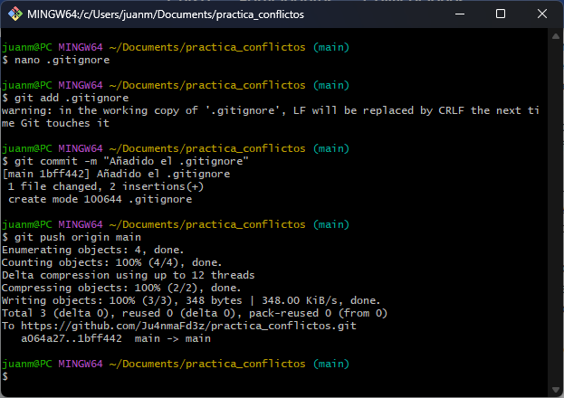

El contenido final del `.gitignore` es:

```
# Ignorar archivos con extensión
*.doc

# Ignorar carpeta
prueba/
```

---

## ✅ Resultado final

Repositorio con una única rama `main`, todas las fusiones completadas correctamente, y el archivo `.gitignore` configurado.
El fichero `index.html` final contiene el siguiente contenido:

```html
<!DOCTYPE html>
<html lang="es">
<head>
  <meta charset="UTF-8">
  <meta name="viewport" content="width=device-width, initial-scale=1.0">
  <title>Página de ejemplo</title>
</head>
<body>
  <p>Juan Manuel Fernández Rodríguez</p>
  <p>Finiquitado :)</p>
</body>
</html>
```

---

📘 **Asignatura:** *Entornos de Desarrollo*

---
